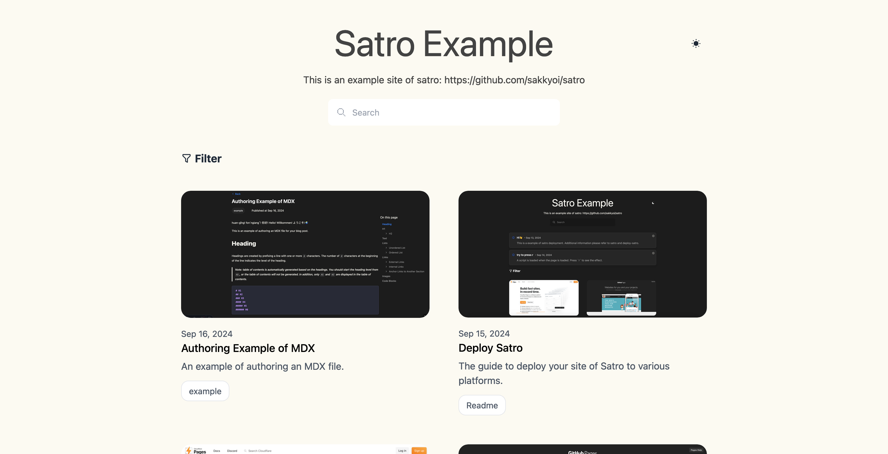

# satro

A ready to use, simple and functional static site generator developed with Astro.

## Installation and Usage

Please refer to the [deploy-satro](https://github.com/sakkyoi/deploy-satro) repository for installation and usage instructions.

## Screenshots

## Demo

The live demo of the site generated. [demo](https://satro-example.pages.dev/)

The live demo about how to authoring your content. [Example](https://satro-example.pages.dev/article/example/)

## License

This project is licensed under the LGPLv3 License - see the [LICENSE](./LICENSE) file for details.
